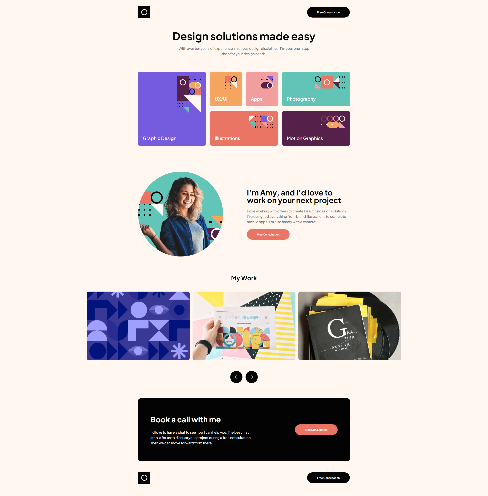

# Frontend Mentor - Single-page design portfolio solution

This is a solution to the [Single-page design portfolio challenge on Frontend Mentor](https://www.frontendmentor.io/challenges/singlepage-design-portfolio-2MMhyhfKVo). Frontend Mentor challenges help you improve your coding skills by building realistic projects.

## Table of contents

- [Overview](#overview)
  - [The challenge](#the-challenge)
  - [Screenshot](#screenshot)
  - [Links](#links)
- [My process](#my-process)
  - [Built with](#built-with)
- [Author](#author)
- [Acknowledgments](#acknowledgments)

**Note: Delete this note and update the table of contents based on what sections you keep.**

## Overview

### The challenge

Users should be able to:

- View the optimal layout for the site depending on their device's screen size
- See hover states for all interactive elements on the page
- Navigate the slider using either their mouse/trackpad or keyboard

### Screenshot

### Links

- Solution URL: [GitHub](https://github.com/AceDub/single-page-design-portfolio)
- Live Site URL: [https://acedub.github.io/single-page-design-portfolio/](https://acedub.github.io/single-page-design-portfolio/)

## My process

### Built with

- Semantic HTML5 markup
- Flexbox
- CSS Grid
- Mobile-first workflow
- [Tailwind](https://tailwindcss.com/) - CSS framework
- [React](https://reactjs.org/) - JS library
- [Swiper](https://swiperjs.com/) - Touch slider

## Author

- Frontend Mentor - [@AceDub](https://www.frontendmentor.io/profile/AceDub)
- GitHub - [@AceDub](https://github.com/AceDub)
